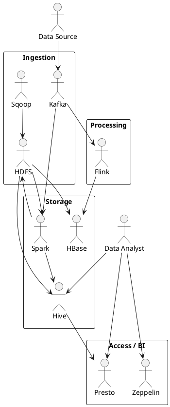

# Big Data & Hadoop – Study Guide (Based on PDFs)

This README explains how to use each PDF in your Big Data learning folder and gives you a clear study order.

The PDFs are grouped into logical modules:

- Hadoop Core (HDFS, MapReduce, YARN, Ecosystem, Design)
- Spark (Intro, RDDs, DataFrames, Streaming)
- Streaming / Messaging (Kafka, Flink, Storm, ZooKeeper)
- NoSQL / Databases (HBase, Cassandra, MongoDB, NoSQL comparison)
- SQL & Query Engines (Hive, Presto, Drill, Phoenix, Pig, Tez)
- ETL / Workflow / Tools (Sqoop, Oozie, Hue, Zeppelin, Admin)

For each PDF you will find:
- What it is about
- Why it is important
- When to study it
- Simple idea of how it fits in the big picture

---

## 1. Hadoop Core

These PDFs give you the foundation of Hadoop as a distributed storage and compute platform.

### 1.1 HDFS.pdf
- **What:** Explains Hadoop Distributed File System (HDFS).
- **Key ideas:** NameNode, DataNodes, blocks, replication factor, high availability.
- **Why it matters:** All other tools in the Hadoop ecosystem (Hive, Spark, HBase, Presto) usually read/write data from HDFS.
- **When to read:** First, right after basic Big Data introduction.
- **Practice:** Learn commands: `hdfs dfs -ls`, `-put`, `-cat`, `-rm`, `-du`, `-df`.

### 1.2 MapReduce.pdf
- **What:** Classic batch processing framework in Hadoop.
- **Key ideas:** Mapper, Reducer, shuffle & sort, input/output formats.
- **Why it matters:** Spark and Tez improved on MapReduce, but the basic idea of “map → shuffle → reduce” is still very important.
- **When to read:** After HDFS. Helpful before Spark Intro.

### 1.3 YARN.pdf
- **What:** Yet Another Resource Negotiator – the cluster resource manager.
- **Key ideas:** ResourceManager, NodeManager, ApplicationMaster, containers.
- **Why it matters:** Spark, MapReduce, and many other engines run on top of YARN in classic Hadoop clusters.
- **When to read:** After MapReduce, before or along with Spark Intro.

### 1.4 HadoopEcosystem.pdf
- **What:** Overview of the many tools in the Hadoop ecosystem.
- **Key ideas:** Shows where Hive, Pig, Sqoop, HBase, Kafka, Spark, etc. fit.
- **Why it matters:** Helps you avoid confusion and know “which tool for which job”.
- **When to read:** Early – after HDFS/MapReduce/YARN so the big picture makes sense.

### 1.5 HadoopDesign.pdf
- **What:** High-level design and architecture choices for Hadoop clusters.
- **Key ideas:** Cluster sizing, replication, high availability, master vs worker nodes.
- **Why it matters:** Useful for thinking like a Data Engineer / Architect, not just a learner.
- **When to read:** After you know HDFS + YARN basics.

---

## 2. Apache Spark

These PDFs move you from classic MapReduce to modern, fast in-memory processing.

### 2.1 SparkIntro.pdf
- **What:** Overview of Apache Spark as a general-purpose compute engine.
- **Key ideas:** RDDs, DAG, lazy evaluation, transformations vs actions, executors.
- **Why it matters:** Spark is the main processing engine in most modern Big Data stacks.
- **When to read:** After Hadoop Core (HDFS, MapReduce, YARN).

### 2.2 RDDs.pdf
- **What:** Deep dive into Resilient Distributed Datasets (RDDs).
- **Key ideas:** Partitions, lineage, caching, persistence, narrow vs wide transformations.
- **Why it matters:** RDDs are the fundamental low-level structure in Spark.
- **When to read:** After SparkIntro.pdf, before DataFrames.pdf.

### 2.3 DataFrames.pdf
- **What:** Spark SQL/DataFrames abstraction on top of RDDs.
- **Key ideas:** Schema, Catalyst optimizer, Tungsten, SQL queries on structured data.
- **Why it matters:** Most real enterprise pipelines use Spark DataFrames/SQL, not bare RDDs.
- **When to read:** After RDDs.pdf.

### 2.4 SparkStreaming.pdf
- **What:** Micro-batch streaming model built into Spark.
- **Key ideas:** DStreams or structured streaming, mini-batches, window operations.
- **Why it matters:** Used for near real-time processing such as logs, IoT, or financial events.
- **When to read:** After Kafka.pdf and SparkIntro/RDDs/DataFrames.

---

## 3. Messaging & Stream Processing

These PDFs cover tools used for real-time data pipelines and streaming analytics.

### 3.1 Kafka.pdf
- **What:** Distributed log and messaging platform.
- **Key ideas:** Topics, partitions, producers, consumers, offsets, consumer groups.
- **Why it matters:** Kafka is the backbone for event streaming in many architectures.
- **When to read:** After Hadoop Core, parallel with Spark Intro.

### 3.2 Flink.pdf
- **What:** Stream processing engine with true event-time semantics.
- **Key ideas:** Streams, stateful operators, watermarks, windows.
- **Why it matters:** Used when you need strong streaming guarantees and low latency.
- **When to read:** After Kafka.pdf, once you are comfortable with Spark.

### 3.3 Storm.pdf
- **What:** Older real-time computation system (topologies, bolts, spouts).
- **Key ideas:** Streams, reliability, message acking.
- **Why it matters:** Good to know historically, some clusters still use it.
- **When to read:** Optional – after Kafka and before or after Flink.

### 3.4 ZooKeeper.pdf
- **What:** Coordination service used by Kafka, HBase, and others.
- **Key ideas:** ZNodes, watches, leader election, configuration storage.
- **Why it matters:** Helps you understand how distributed systems coordinate.
- **When to read:** Alongside Kafka and HBase.

---

## 4. NoSQL & Databases

These PDFs introduce Big Data storage engines beyond classic relational databases.

### 4.1 Hbase.pdf
- **What:** Column-oriented NoSQL store built on top of HDFS.
- **Key ideas:** Tables, column families, regions, region servers, row keys.
- **Why it matters:** Good for time-series, key-value, and sparse wide tables.
- **When to read:** After HDFS and ZooKeeper.

### 4.2 Cassandra.pdf
- **What:** Distributed, highly available, peer-to-peer NoSQL database.
- **Key ideas:** Partitions, replication, consistency levels, ring topology.
- **Why it matters:** Used where you need very high availability and write throughput.
- **When to read:** After you understand basic NoSQL concepts.

### 4.3 MongoDB.pdf
- **What:** Document-oriented NoSQL database.
- **Key ideas:** Collections, documents, indexes, flexible schema.
- **Why it matters:** Often used for application data, schemas that change frequently.
- **When to read:** Anytime after basic database concepts.

### 4.4 NoSQL / ChoosingDatabase.pdf
- **What:** General comparison of NoSQL types and how to choose a database.
- **Key ideas:** Key-value, document, column-family, graph; CAP trade-offs.
- **Why it matters:** Helps you pick HBase vs Cassandra vs MongoDB based on use case.
- **When to read:** After you’ve read at least one or two database PDFs.

---

## 5. SQL Engines & Query Layers

These PDFs show how to query Big Data using SQL-like interfaces.

### 5.1 Hive.pdf
- **What:** Data warehouse system on top of Hadoop using SQL-like language.
- **Key ideas:** Tables, partitions, metastore, execution via MapReduce/Tez/Spark.
- **Why it matters:** Very common entry point for analysts and engineers to query HDFS data.
- **When to read:** After HDFS and MapReduce.

### 5.2 Presto.pdf
- **What:** Distributed SQL engine for interactive queries.
- **Key ideas:** Connectors to Hive, Kafka, relational DBs; low-latency federated queries.
- **Why it matters:** Great for ad-hoc analysis and dashboards.
- **When to read:** After Hive.pdf.

### 5.3 Drill.pdf
- **What:** SQL engine for large-scale datasets with schema-on-read.
- **Key ideas:** Querying files (Parquet, JSON, etc.) without heavy schema setup.
- **Why it matters:** Useful when you want flexible exploration of data.
- **When to read:** After Hive/Presto.

### 5.4 Phoenix.pdf
- **What:** SQL layer on top of HBase.
- **Key ideas:** Maps tables to HBase, secondary indexes, low-latency queries.
- **Why it matters:** Lets you query HBase data with SQL.
- **When to read:** After HBase.pdf.

### 5.5 Pig.pdf
- **What:** High-level scripting language for analyzing large datasets (Pig Latin).
- **Key ideas:** Data flows, relation operations, scripts compiled to MapReduce.
- **Why it matters:** Older technology, but still good to understand ETL-style scripting.
- **When to read:** Optional – after Hive.

### 5.6 Tez.pdf
- **What:** Execution framework that improves on MapReduce for Hive.
- **Key ideas:** DAG-based execution for faster Hive queries.
- **Why it matters:** Many Hive deployments run on Tez instead of raw MapReduce.
- **When to read:** After Hive and MapReduce.

---

## 6. ETL, Workflow & Tools

These PDFs cover data movement tools, schedulers, and UI/workbench tools.

### 6.1 Sqoop.pdf
- **What:** Tool for bulk data transfer between Hadoop and relational databases.
- **Key ideas:** Import/export, mapping between RDBMS tables and HDFS/Hive.
- **Why it matters:** Often used to ingest data from Oracle/MySQL/SQL Server into Hadoop.
- **When to read:** After HDFS and Hive.

### 6.2 Oozie.pdf
- **What:** Workflow scheduler for Hadoop jobs.
- **Key ideas:** Coordinators, workflows, actions (Hive, MR, Pig, shell).
- **Why it matters:** Used to orchestrate multi-step Big Data pipelines.
- **When to read:** After you know what Hive/Spark/MapReduce jobs look like.

### 6.3 Hue.pdf
- **What:** Web UI for Hadoop components.
- **Key ideas:** Browsing HDFS, submitting Hive queries, viewing jobs.
- **Why it matters:** Makes it easier to work with a cluster without using only the CLI.
- **When to read:** Anytime after Hadoop Core.

### 6.4 Zeppelin.pdf
- **What:** Notebook for interactive data analysis (similar to Jupyter but for Big Data).
- **Key ideas:** Notebooks, interpreters, visualizations, multi-language support.
- **Why it matters:** Great for exploration using Spark, Hive, etc.
- **When to read:** After SparkIntro and Hive.

### 6.5 OtherAdmin.pdf / Admin Slides
- **What:** Administration, monitoring, tuning of Hadoop and related tools.
- **Key ideas:** Logs, metrics, resource usage, troubleshooting.
- **Why it matters:** Necessary for operating clusters in production, not just learning.

---

## Simple Big Data Architecture Diagram (PlantUML)

Below is a simple high-level view that you can reuse in your docs.

You can generate a PNG from this PlantUML in any PlantUML-compatible tool or plugin.

---

## Suggested Study Order (Short Version)

1. HDFS, MapReduce, YARN, HadoopEcosystem
2. HadoopDesign
3. SparkIntro, RDDs, DataFrames
4. Kafka, SparkStreaming, Flink
5. HBase, Cassandra, MongoDB, NoSQL comparison
6. Hive, Presto, Drill, Phoenix, Pig, Tez
7. Sqoop, Oozie, Hue, Zeppelin, Admin

Use this README as the main index for your Big Data learning and link each PDF to the sections above.
